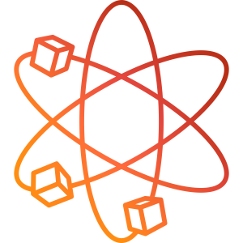

# Rayon 2

Rayon은 Minecraft Java Edition 1.21.8 Dedicated Server에서 강체 물리를 제공하는 Fabric 전용 라이브러리 모드입니다. 물리 상태는 서버가 단독으로 계산하며 접속하는 클라이언트에는 Rayon을 설치할 필요가 없습니다.

## 요구 환경

- Minecraft 1.21.8
- Java 21 이상
- Fabric Loader 0.19.3 이상
- Fabric API 0.136.1+1.21.8 이상
- Polymer 0.13.13+1.21.8 (Rayon JAR에 포함)

Forge, NeoForge, Architectury와 클라이언트 렌더링은 지원하지 않습니다.

## 설치

`rayon-2.0.0+1.21.8.jar`와 Fabric API를 서버의 `mods` 폴더에 넣습니다. Rayon JAR에는 Polymer Core, Virtual Entity, Resource Pack 모듈과 Java용 Libbulletjme가 포함되며, 지원 플랫폼의 네이티브는 최초 시작 시 `<서버 폴더>/.rayon/natives/17.4.0/` 아래 해시 캐시에 추출됩니다.

기본 지원 플랫폼은 다음과 같습니다.

- Windows x86-64
- Linux x86-64
- macOS x86-64
- macOS ARM64

## 개발

Windows PowerShell에서 다음 명령으로 빌드합니다.

```powershell
.\gradlew.bat clean build --no-daemon
```

Dedicated Server 개발 실행은 다음 명령을 사용합니다.

```powershell
.\gradlew.bat runServer --no-daemon
```

Polymer 의존성은 `gradle.properties`의 `polymer_version`으로 관리하며, 현재 Minecraft 1.21.8 호환 버전인 `0.13.13+1.21.8`을 사용합니다. 다음 개발 단계에서는 서버사이드 가상 엔티티와 리소스 팩 확장을 바로 사용할 수 있습니다.

빌드 산출물은 `build\libs\rayon-2.0.0+1.21.8.jar`입니다. 빌드는 Fabric 공식 Mojang mappings를 사용하며 Lazurite Maven 저장소, Toolbox, Transporter에 의존하지 않습니다.

## 서버 물리 API 원칙

- `MinecraftSpace.get(ServerLevel)`로 월드별 물리 공간을 조회합니다.
- `EntityPhysicsElement`를 구현한 서버 엔티티는 load/unload lifecycle에 따라 자동 등록·해제됩니다.
- 외부 스레드에서 impulse를 적용할 때는 `EntityRigidBody#enqueueImpulse`를 사용합니다.
- Bullet 객체를 직접 변경하는 저수준 메서드는 Rayon 물리 스레드 밖에서 호출하면 안 됩니다.
- `PhysicsSpaceEvents.STEP`과 충돌 이벤트는 물리 스레드에서 호출되므로 callback에서 `Level` 또는 `Entity`를 직접 변경하면 안 됩니다.
- 물리 결과의 위치·선속도는 다음 서버 틱에 바닐라 엔티티 상태로 적용됩니다. 전체 Quaternion은 Bullet 상태에 유지되지만 바닐라 클라이언트의 roll 렌더링은 제공하지 않습니다.

## 저장 데이터

Rayon 2는 엔티티 저장 데이터의 `rayon` compound에 `data_version: 2`를 기록합니다. orientation과 선속도·각속도, 질량, drag, 마찰, restitution, 지형 로딩, 부력·drag 유형을 저장하며 NaN, Infinity, 음수 물성값과 잘못된 enum 값을 안전한 기본값으로 교정합니다.

1.19.4의 최상위 `orientation`, `linearVelocity`, `angularVelocity` 및 기존 물성 필드는 로드할 수 있으며 다음 저장부터 버전 2 형식으로 변환됩니다.

## 라이선스와 출처

Rayon은 MIT 라이선스로 배포됩니다. 원 프로젝트는 The Lazurite Team이 개발했습니다.
